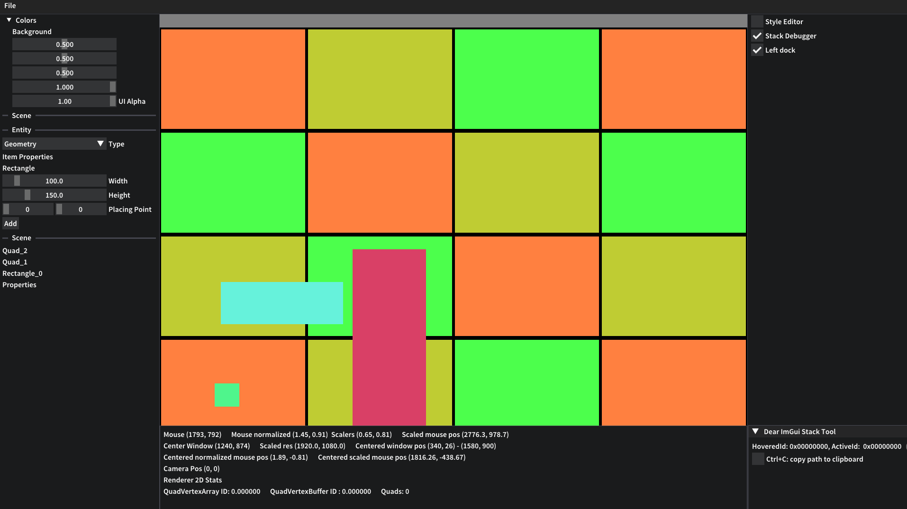
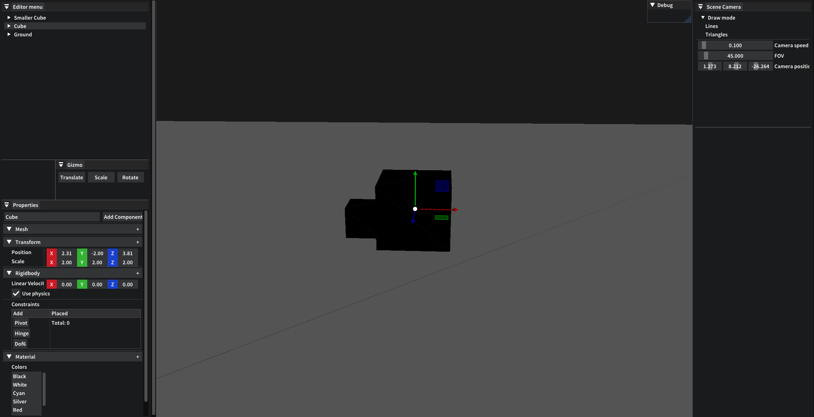
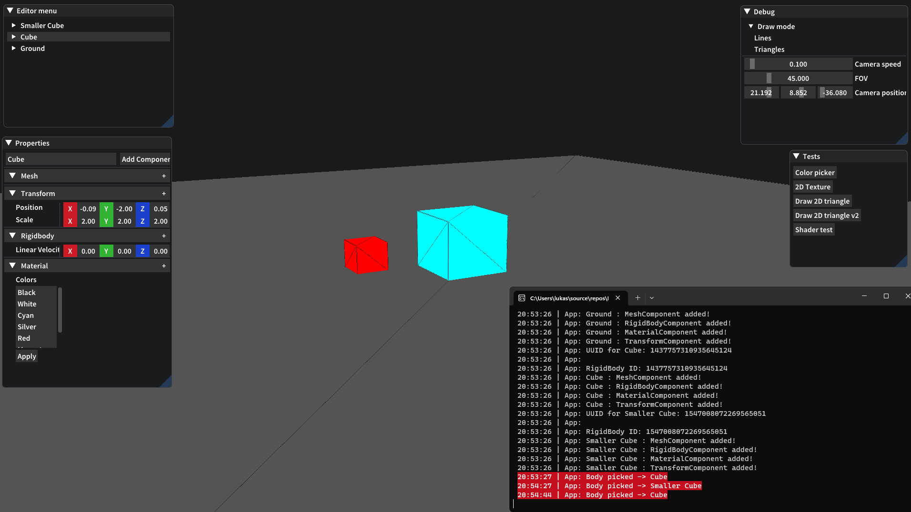

# LkEngine Development
> Development progress.

The content is listed in a format of one yar at a time.

---

* [2024](#Year-2024)
  - [January](#2024-January)
  - [February](#2024-February)
* [2023](#2023)
  - [March](#2023-March)
  - [October](#2023-October)
  - [November](#2023-November)
  - [December](#2023-December)

---

# 2024 
## January (2024)

### January 1
The current look of the engine, lots to polish.

	
	

	

Once again thanks to Atilla for his handsome face. I need to add new images for 
the *Create Menu* (what I call it for now) but Atilla's beauty will do for now.
 

### January 28
Some 3D rendering. The *Translate* and *Rotate* gizmo modes can be seen as well.

	
	
 

	
	

	

---
<!----------------------------------------------------------->
<!--| FEBRUARY |-->
<!----------------------------------------------------------->

## February (2024)
### February 15
Last couple of weeks has mostly been work on assets and asset loading.  
Some nice improvements can be seen though, especially with the new environment cubemap.

	
	

	
	

	

	
	

	

 

### February 4

	
	

	Faulty renderered mesh because of a misaligned vertexbuffer and shader layout
	

 

---
<!----------------------------------------------------------->
<!--| 2023 | DECEMBER |-->
<!----------------------------------------------------------->

# 2023
## December (2023)
### December 4
It has been a while since I last posted some progress. 
What's new is that I've added functionality to pass textures to draw calls for 2D rendering 
which can be seen in the images below :smile:. 
(sincere thanks to Atilla for being my debugging texture)

	
	

	 
	The different rendered entities can all be interacted with, the selected entity menu is shown to the right
	

	 
	
	

	

 

---
<!----------------------------------------------------------->
<!--| 2023 | NOVEMBER |-->
<!----------------------------------------------------------->

## November (2023) 
### November 1

	
	

		Rendering a grid, will eventually expand to be used as a base for creating 2D games such as Super Mario
	

 

<!----------------------------------------------------------->
<!--| 2023 | OCTOBER |-->
<!----------------------------------------------------------->

## October (2023) 

### October 16

	

Rendering multiple rectangles that can be adjusted indivually thanks to the entity component system.
The entity entries can be seen on the right sidebar.

 

### October 20

	

Rendered entities that consist of mesh, sprite and transform components. The UI has been improved.

 

### October 29

	
	

		Rendering lines and quads using the new 2D renderer
	

 

	

Got a base UI layout going with two rectangles that can be moved and have their colors changed.

 

---

 

<!----------------------------------------------------------->
<!--| LukkelEngine OLD |-->
<!----------------------------------------------------------->

# LukkelEngine  (Old) 
## March 2023
### March 19
Improved the UI, added constraints and updated the event handling. I was in dire need to use an event system as the 
world physics cant really function without it. 

	

The cyan cube has a pivot constraint that can be added and removed with the UI (constraints menu to the left)

	

	

Colliding objects are set to the color black whenever a valid detection takes place

 

### March 12

	

	

Selected object with raycasting after clicking left mouse button

	

Changed color of selected object

	

View of the platform

---

## February, 2023
### February 26

	

Scene overview with a cube

 

	

The same cube but from a closer distance

 

--- 
