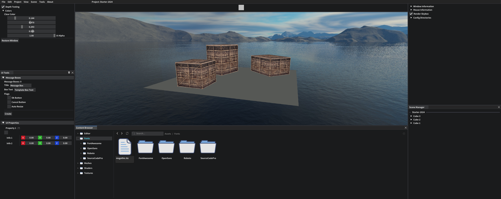

# LkEngine Development
> Development progress.

---

* [2025](#Year-2025)
* [2024](#Year-2024)
  - [January](#2024-January)
  - [February](#2024-February)
* [2023](#2023)
  - [March](#2023-March)
  - [October](#2023-October)
  - [November](#2023-November)
  - [December](#2023-December)

 

---

# 2025 
### January 8
Early view of the content browser and content outliner.

 

---

 

# 2024 
## January (2024)

### January 28
Some 3D rendering. The *Translate* and *Rotate* gizmo modes can be seen as well.

 

### January 1
The current look of the engine, lots to polish.

Once again thanks to my best friend **Atilla** for his handsome face. I need to add new images for the *Create Menu* (what I call it for now) 
but Atilla's beauty will do for now.

 

---
<!----------------------------------------------------------->
<!--| FEBRUARY |-->
<!----------------------------------------------------------->

## February (2024)
### February 15

Last couple of weeks has mostly been work on assets and asset loading.  
Some nice improvements can be seen though, especially with the new environment cubemap.

 

### February 4

Faulty renderered mesh because of a misaligned vertexbuffer and shader layout.

 

---

 

<!----------------------------------------------------------->
<!--| 2023 | DECEMBER |-->
<!----------------------------------------------------------->

# 2023
## December (2023)

### December 4
It has been a while since I last posted some progress. 
What's new is that I've added functionality to pass textures to draw calls for 2D rendering 
which can be seen in the images below :smile:. 
(sincere thanks to Atilla for being my debugging texture)

 

---
<!----------------------------------------------------------->
<!--| 2023 | NOVEMBER |-->
<!----------------------------------------------------------->

## November (2023) 
### November 1

---

<!----------------------------------------------------------->
<!--| 2023 | OCTOBER |-->
<!----------------------------------------------------------->

## October (2023) 

### October 29

Rendering lines and quads using the new 2D renderer.

 

### October 20

Rendered entities that consist of mesh, sprite and transform components. The UI has been improved.

 

### October 16

Got a base UI layout going with two rectangles that can be moved and have their colors changed.

 

Rendering multiple rectangles that can be adjusted indivually thanks to the entity component system.
The entity entries can be seen on the right sidebar.

 

---

 

<!----------------------------------------------------------->
<!--| LukkelEngine OLD |-->
<!----------------------------------------------------------->

# LukkelEngine  (Old) 
## March 2023
### March 19
Improved the UI, added constraints and updated the event handling. 
Not happy with the physics implementation, will redo it in the future.

Colliding objects are set to the color black whenever a valid detection takes place.

 

The cyan cube has a pivot constraint that can be added and removed with the UI (constraints menu to the left).

 

### March 12

 

Selected object with raycasting after clicking left mouse button.

 

Changed color of selected object.

 

View of the platform.

---

## February, 2023
### February 26

Scene overview with a cube.

 

The same cube but from a closer distance.

--- 
