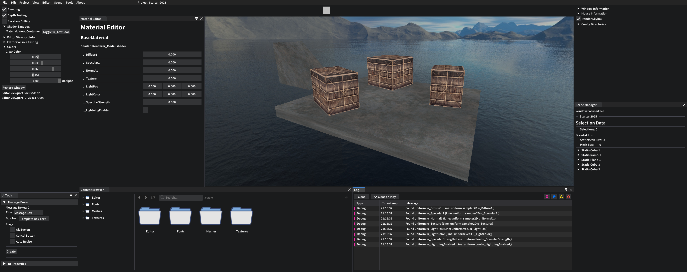
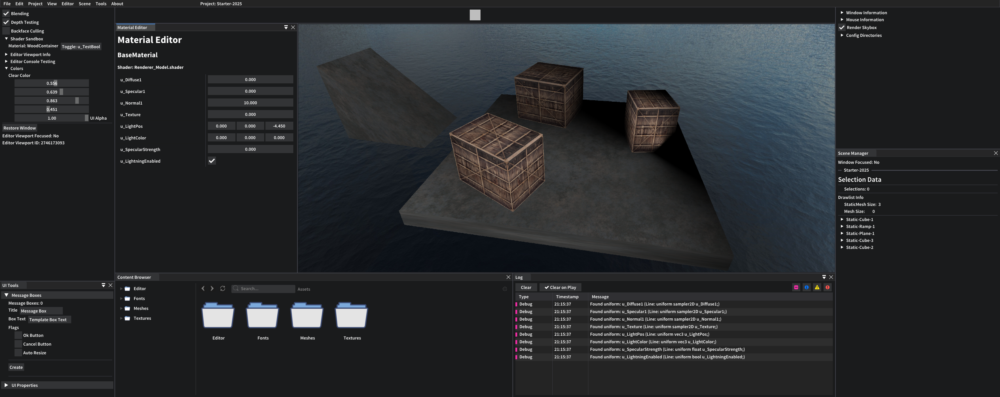
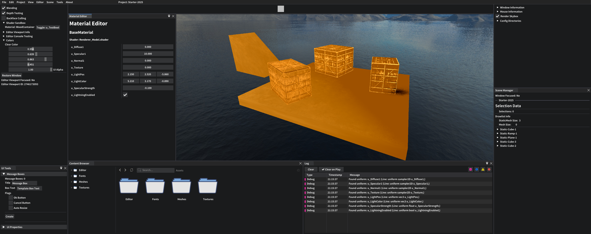
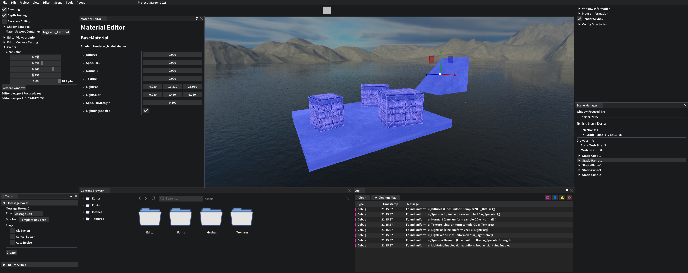
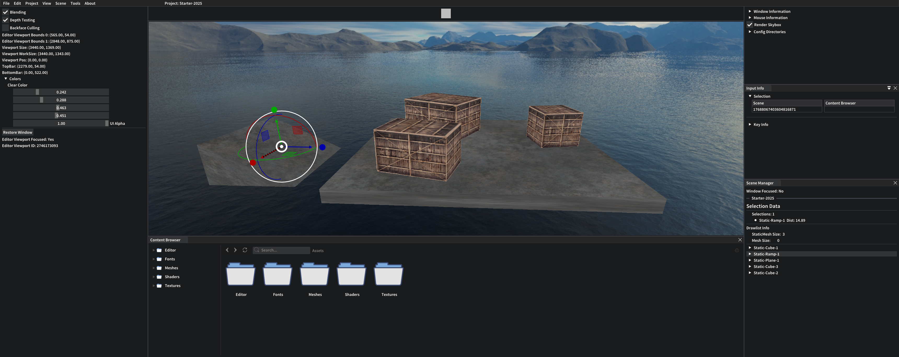
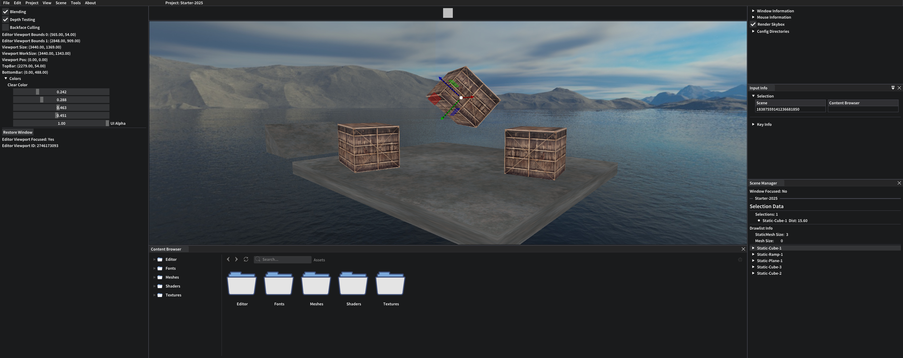
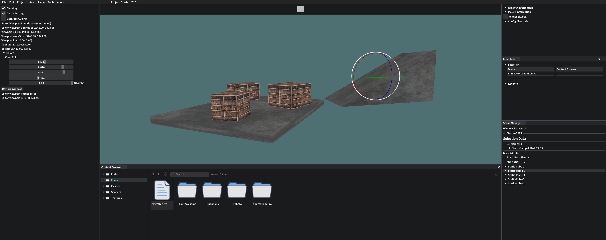

# LkEngine

<!-- Badges -->
</img>

</img>

	

**LkEngine** (pronounced *Lukkel-Engine*) is a game and rendering engine written in C\++20.  
This project is for fun and to learn more, I just love to code. 
I have lots of ideas that I want to see if they could work and this project is good environment for me to try stuff out.

## Content
1. [Engine](#Engine)
2. [Setup and Build](#Setup-and-Build)
3. [Development](#Engine-Development)
	- [Showcase](#Engine-Development-Showcase)
4. [Dependencies](#Engine-Dependencies)

---

* [Engine Design](./Docs/Engine.md)  
* [Engine API](https://lukkelele.github.io/LkEngine/Doxygen/Generated/Html/index.html)  
* [Development Journal](./Docs/Development.md)  
* [github.io.lukkelele/LkEngine](https://lukkelele.github.io/LkEngine/)  

---

## Engine 
For a detailed view of the engine, check out the [Engine Design](./Docs/Engine.md) 
and the [Engine API](https://lukkelele.github.io/LkEngine/Doxygen/Generated/Html/index.html).

#### Implemented
:white_check_mark: OpenGL support (4.5, 3.3) 
:white_check_mark: Profiling and instrumentation 
:white_check_mark: Serialization and persistence 
:white_check_mark: Camera system 
:white_check_mark: Raycasting 
:white_check_mark: Asset loading (gltf, fbx, obj) 
:white_check_mark: Custom themes 
:white_check_mark: Automated tests 
:white_check_mark: CI/CD 

#### In Progress
:large_orange_diamond: Editor (LkEditor) 
:large_orange_diamond: Test Framework (LTesto) 
:large_orange_diamond: Rendering debug tools (e.g drawing lines in world space) 

#### Todo
:black_square_button: Static reflection 
:black_square_button: Physics (2D/3D)  
:black_square_button: Vulkan support 

---

## Setup and Build 

View [BUILD.md](./BUILD.md) for information on how to setup and build the engine.

| **Compiler** | **Version** | **Supported** |
| :-------- | :-------: | :------: |
| MSVC | 17.9.7 (1939)| :white_check_mark: |
| GCC | 14.2.1 | :white_check_mark: |
| Clang | - | :x: |

---

## Development 

For development I've been using Visual Studio Community 22 (64-bit) on Windows. 

See more images and screenshots in the [development](Docs/Development.md) documentation.

### Showcase 

---

## Dependencies 
- [glfw3](https://github.com/glfw/glfw)
- [glad](https://github.com/Dav1dde/glad)
- [spdlog](https://github.com/gabime/spdlog)
- [ImGui](https://github.com/ocornut/imgui)
- [ImGuizmo](https://github.com/CedricGuillemet/ImGuizmo)
- [imgui-node-editor](https://github.com/thedmd/imgui-node-editor)
- [nativefiledialog-extended](https://github.com/btzy/nativefiledialog-extended)
- [yaml-cpp](https://github.com/jbeder/yaml-cpp)
- [glm](https://github.com/g-truc/glm)
- [entt](https://github.com/skypjack/entt)
- [Tracy](https://github.com/wolfpld/tracy)
- [assimp](https://github.com/assimp/assimp)
- [box2d](https://github.com/erincatto/box2d)
- [python3](https://www.python.org/downloads/)
