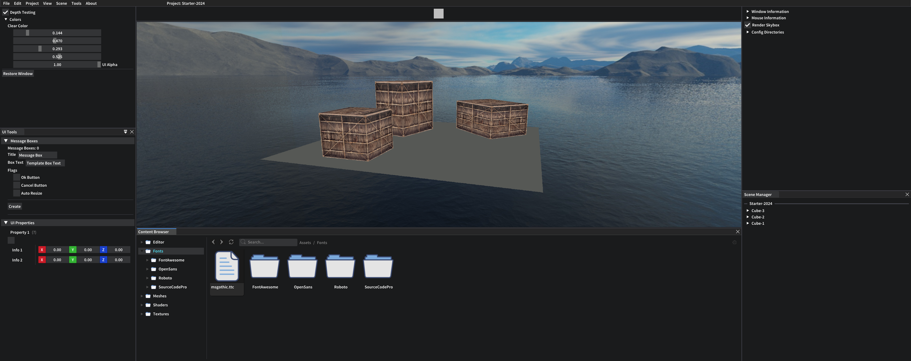

# LkEngine :shaved_ice: 
> Game Engine written in C++20<br>

---


## Platform Support
#### :white_check_mark: Windows<br>
#### :black_square_button: Linux <br>

## Content
1. [Project](#Project)
2. [Setup and Installation](#Setup-and-Installation)
    - [Windows](#Platform-Windows)
	- [Linux](#Platform-Linux)
	- [Dependencies](#Engine-Dependencies)
3. [Engine Features](#Engine-Features)
4. [Development](#Engine-Development)
	- [Showcase](#Engine-Development-Showcase)

---

# Project <a id="Project"></a> <a href="https://lukkelele.github.io/LkEngine" target="_blank"> 
</a>

**LkEngine** (pronounced *Lukkel-Engine*) is a game engine written in C\++20. <br>
This project is for fun and to learn more. I really enjoy coding so I have a blast doing it.<br>
I have lots of ideas that I want to see if they could work and this project is good environment for me to try stuff out.
<br>
<br>
The goal is to have an application with an API that is good for performance and easy to use.<br>
With features such as:
- Multiple platform support.
- Static reflection.
- Serialization and persistance.
- Crash and error handling.
- Development tools (e.g debugging and profiling).
- Application launcher.

## Setup and Installation <a id="Setup-and-Installation"></a>
For development I've been using Visual Studio Community 22 (64-bit).<br>

### Windows <a id="Platform-Windows"></a>
Make sure the following are installed:

| Package | Link                          |
|----------------|--------------------------------------------|
| CMake | [Download](https://cmake.org/download/) |
| C/C++ Compiler | [Download](https://visualstudio.microsoft.com/vs/features/cplusplus/) |
| Make | [Download](https://gnuwin32.sourceforge.net/packages/make.htm) |
| Python3 | [Download](https://www.python.org/downloads/windows/) |

Most dependencies are sorted by scripts available in `Tools/` that help setting up the engine.


1. Clone the repo and with all submodules.<br>
    ```shell
	git clone --recursive https://github.com/lukkelele/LkEngine.git
	```
2. Enter the **Tools** directory.<br>
3. Run the setup script **LkEngine-Setup.bat**.<br>
   It is also possible to run the script directly in a shell which yields the same result as the bat script runs **LkEngine-Setup.py**.
	```shell
	python LkEngine-Setup.py
    ```
4. All dependencies are then handled by the script. The built static libraries are moved to their desired spot inside the _'External'_ directory. 
5. Done! :white_check_mark:

### Linux <a id="Platform-Linux"></a>
:warning: **TODO**

### Dependencies <a id="Engine-Dependencies"></a>
- [glfw3](https://github.com/glfw/glfw)
- [glad](https://github.com/Dav1dde/glad)
- [spdlog](https://github.com/gabime/spdlog)
- [ImGui](https://github.com/ocornut/imgui)
- [ImGuizmo](https://github.com/CedricGuillemet/ImGuizmo)
- [imgui-node-editor](https://github.com/thedmd/imgui-node-editor)
- [nativefiledialog-extended](https://github.com/btzy/nativefiledialog-extended)
- [yaml-cpp](https://github.com/jbeder/yaml-cpp)
- [glm](https://github.com/g-truc/glm)
- [entt](https://github.com/skypjack/entt)
- [Tracy](https://github.com/wolfpld/tracy)
- [assimp](https://github.com/assimp/assimp)
- [box2d](https://github.com/erincatto/box2d)
- [python3](https://www.python.org/downloads/)

---

## Engine Features <a id="Engine-Features"></a>

### Available
:white_check_mark: Serialization<br>
:white_check_mark: Renderer Submission System<br>
:white_check_mark: Camera System<br>
:white_check_mark: Asset Manager<br>
:white_check_mark: Profiling and Instrumentation<br>

### In Progress
:black_square_button: Static Reflection<br>
:black_square_button: Physics and Raycasting<br>

---

### Todo
:small_blue_diamond: **Vulkan Support.**<br>
:small_blue_diamond: **Renderer Debugging tools (e.g drawing lines in world space).**<br>
:small_blue_diamond: **3D Physics and Raycasting.**<br>

<!------------------------------------------------------------>

---

## Development <a id="Engine-Development"></a>

See more images and screenshots in the [documentation](Docs/Development.md).

* [github.io.lukkelele/LkEngine](https://lukkelele.github.io/LkEngine/) <br>
* [github.io.lukkelele/LkEngine/Development](https://github.com/lukkelele/LkEngine/blob/gh-pages/Development.md)


### Showcase <a id="Engine-Development-Showcase"></a>


